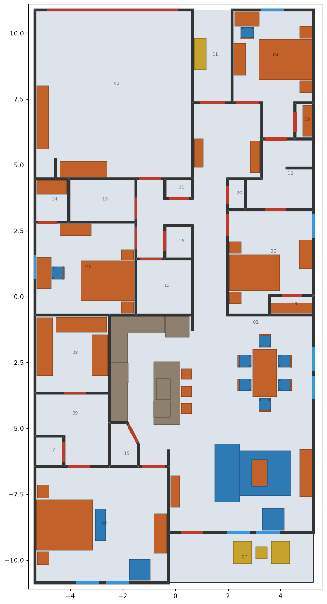

# prism

## Claude Code plugins

`.claude/settings.json` registers the
[Banana Claude](https://github.com/AgriciDaniel/banana-claude) marketplace,
pinned to `v3.0.0`, and enables the `banana-claude` plugin for this project.
When you open the repo in Claude Code and trust the folder, it asks to install
the plugin.

Banana Claude needs Claude Code 2.1.199+, Python 3.11+ with `python3` on
`PATH`, and a Gemini API key from a billing-enabled Google AI project. Claude
Code asks for the key when the plugin is enabled and stores it as a sensitive
plugin value. Keep keys out of this repository.

Usage:

```text
/banana-claude:banana generate an urban 16:9 hero image with left-side copy space
```

It plans offline first and needs your approval before each paid Gemini request.

To upgrade, change `ref` in `.claude/settings.json` to a newer release tag.

## Floor-plan models

- `models/prism-unfurnished.glb` is the original export: 21 rooms, 85 walls,
  22 doors, 9 windows and 6 kitchen fixtures.
- `models/prism-furnished.glb` is the same plan with 52 furniture pieces added.
  Each piece is its own node on layer `FURNITURE`, tagged with its room, and
  uses the file's existing `furniture-*` materials. Floor nodes also carry an
  inferred `roomType`.



To rebuild the furnished model:

```sh
pip install -r tools/furnish/requirements.txt
cd tools/furnish
python3 furnish.py ../../models/prism-unfurnished.glb ../../models/prism-furnished.glb
python3 plot.py ../../models/prism-furnished.glb ../../docs/plan-furnished.png
```

The layout lives in `furnish.py`. The script refuses to write if any piece
sits outside its room, overlaps another piece or a kitchen fixture, blocks a
door swing (0.85 m each side), or puts something taller than 0.9 m in front of
a window. Bathrooms and the laundry are left empty because their plumbing
fixtures are not furniture.
